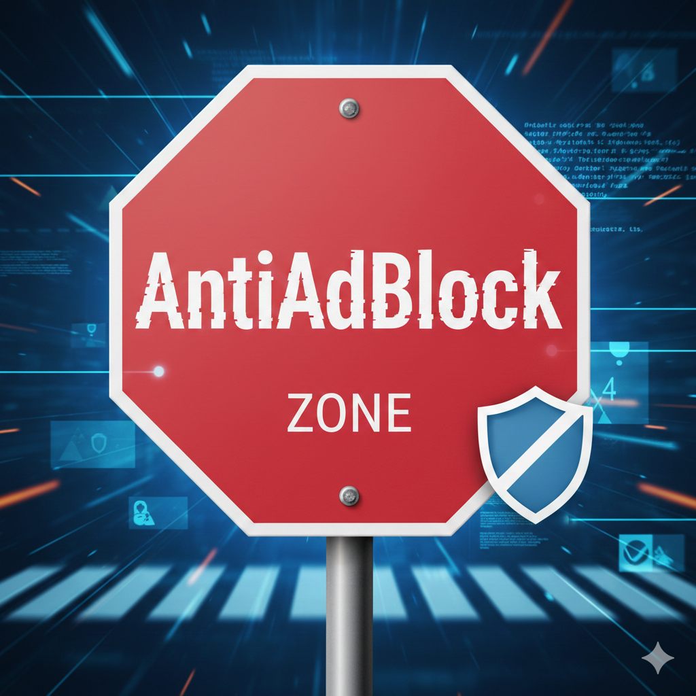

# 🚀 AntiAdBlock


 ## **Détecteur d'AdBlock simple, rapide et facile à intégrer sur n'importe quel site web.**

---

## 🧐 Aperçu


## ✨ Fonctionnalités
- ✅ **Indispensable** : Force la désactivation des bloqueurs de publicités (AdBlocks) pour accéder au contenu.
- ✅ **Entièrement Personnalisable** : Modifiez facilement le message, le design de l'alerte ou l'action à entreprendre (redirection, blocage, simple message).
- ✅ **Intégration Facile** : Une seule ligne de code suffit pour protéger l'intégralité de votre site.

## 🛠 Tech Stack

| Technologie | Usage |
| :--- | :--- |
|  | **Logique de détection** : Coeur du script pour repérer les bloqueurs. |
|  | **Structure** : Création de la fenêtre d'alerte et des éléments du DOM. |
|  | **Design** : Mise en page du popup. |

## 🚀 Installation & Lancement

1. **Clonez le projet dans le dossier de votre site web.**
   ```bash
   git clone https://github.com/BlackAngelTVdev/AntiAdBlock.git
   cd AntiAdBlock
   ```
2. **Intégrer au fichier HTML**
    Ajoutez cette ligne avant la fermeture de la balise `</body>` :
   ```html
   <script src="./anti.js"></script>
## 🤝 Contribution
1. Forkez le projet
2. Créez votre branche (git checkout -b feature/AmazingFeature)
3. Commit (git commit -m 'Add some AmazingFeature')
4. Push (git push origin feature/AmazingFeature)
5. Ouvrez une Pull Request

## 👤 Auteur

**BlackAngelTVdev**

---
## 📄 Licence

Ce projet est sous licence :
